# BoardForge — Architecture Principles

---

## 1. Architectural Style: Modular Monolith

BoardForge adopta una arquitectura de **Monolito Modular (*Modular Monolith*)**.

```mermaid
graph TD
    subgraph ModularMonolith["BoardForge Monolith Engine"]
        subgraph Mod_Identity["Module: Identity & Access"]
            D_ID[Domain] --- A_ID[App Services] --- I_ID[Infra]
        end
        subgraph Mod_Catalog["Module: Hardware Catalog"]
            D_CAT[Domain] --- A_CAT[App Services] --- I_CAT[Infra]
        end
        subgraph Mod_BoardView["Module: BoardView Engine"]
            D_BV[Domain] --- A_BV[App Services] --- I_BV[Infra]
        end
        subgraph Mod_Schematics["Module: Schematics Engine"]
            D_SC[Domain] --- A_SC[App Services] --- I_SC[Infra]
        end
        subgraph Mod_Measurements["Module: Measurements & Diagnostics"]
            D_ME[Domain] --- A_ME[App Services] --- I_ME[Infra]
        end
        subgraph Mod_Knowledge["Module: Repair Knowledge"]
            D_KN[Domain] --- A_KN[App Services] --- I_KN[Infra]
        end
    end

    API[HTTP / REST / WebSocket Interfaces] --> Mod_Identity
    API --> Mod_Catalog
    API --> Mod_BoardView
    API --> Mod_Schematics
    API --> Mod_Measurements
    API --> Mod_Knowledge
```



### 1.1. Justificación y Racional Arquitectónico
1. **Evitar la Falacia de los Microservicios Prematuros:** Distribuir un sistema en microservicios al inicio añade una complejidad operativa catastrófica (latencia de red, consistencia eventual, transacciones distribuidas, orquestación, *tracing* distribuido) sin que exista aún la escala o el tamaño de equipo que lo justifique.
2. **Dominio Altamente Interrelacionado:** El núcleo de BoardForge (Pines $\leftrightarrow$ NETs $\leftrightarrow$ Componentes $\leftrightarrow$ Mediciones $\leftrightarrow$ Esquemáticos) exige una consistencia transaccional y un rendimiento de consulta in-memory / relational que los microservicios degradarían drásticamente.
3. **Mantenibilidad y Productividad:** Un único repositorio y artefacto de despliegue permite refactorizaciones seguras con soporte del compilador/linter, simplifica los tests de integración y acelera el desarrollo sin penalizaciones operativas.
4. **Vía de Extracción Clara (*Extractable by Design*):** Si en el futuro un módulo específico (por ejemplo, el conversor de archivos BoardView/PDF pesados o el motor de inferencia de IA) requiere escalado independiente, sus límites estrictos permitirán extraerlo a un microservicio o *worker* asíncrono con mínimo esfuerzo.

---

## 2. Structural Patterns & Paradigm

BoardForge combina los principios de **Clean Architecture**, **Hexagonal Architecture (Ports & Adapters)** y **Domain-Driven Design (DDD)** táctico dentro de cada módulo.

```text
┌─────────────────────────────────────────────────────────────┐
│                 Interfaces Layer (Drivers)                  │
│       [REST Controllers, GraphQL, CLI, WebSockets]          │
├─────────────────────────────────────────────────────────────┤
│                 Application Layer (Use Cases)               │
│       [Commands, Queries, DTOs, Application Services]       │
├─────────────────────────────────────────────────────────────┤
│                    Domain Layer (Core)                      │
│       [Entities, Value Objects, Aggregates, Events,         │
│        Domain Services, Repository Interfaces (Ports)]      │
├─────────────────────────────────────────────────────────────┤
│              Infrastructure Layer (Adapters)                │
│       [DB Persistence, File Storage, External Parsers,       │
│        Message Bus, Security Implementations]               │
└─────────────────────────────────────────────────────────────┘
```

### 2.1. Regla de Dependencia (Dependency Rule)
Las dependencias en el código apuntan **únicamente hacia adentro**. El Dominio no conoce la Aplicación, la Infraestructura ni las Interfaces externas:

$$\text{Interfaces} \longrightarrow \text{Application} \longrightarrow \text{Domain} \longleftarrow \text{Infrastructure}$$

- **Domain Layer:** Contiene la lógica de negocio pura, reglas de validación de ingeniería electrónica, entidades, *Value Objects* y la definición de puertos (*Interfaces* de repositorios). No depende de ningún framework, ORM ni base de datos.
- **Application Layer:** Orquesta los casos de uso del sistema. Define los DTOs de entrada y salida, coordina transacciones y despacha eventos de dominio.
- **Infrastructure Layer:** Implementa los adaptadores de los puertos definidos en el Dominio y la Aplicación (ej. repositorios PostgreSQL, clientes de almacenamiento S3/Cloud Storage, parsers de binarios).
- **Interfaces Layer:** Expone los puntos de entrada para los clientes (API REST, WebSocket para sincronización, etc.).

---

## 3. SOLID & Software Engineering Principles

1. **Single Responsibility Principle (SRP):** Cada clase, función o caso de uso tiene una única razón para cambiar. Los servicios de aplicación son atómicos (un caso de uso por clase/handler).
2. **Open/Closed Principle (OCP):** Nuevos parsers de formatos de BoardView (`.brd`, `.cad`, `.fz`, `.tvw`) se añaden implementando la interfaz `BoardFileParser` sin modificar el código de procesamiento existente.
3. **Liskov Substitution Principle (LSP):** Cualquier implementación de almacenamiento (ej. `LocalStorageAdapter` vs `S3StorageAdapter`) o repositorio debe ser completamente intercambiable sin alterar el comportamiento esperado por la capa de aplicación.
4. **Interface Segregation Principle (ISP):** Las interfaces son pequeñas y específicas de cada consumidor. Se evita la creación de interfaces monstruosas con decenas de métodos.
5. **Dependency Inversion Principle (DIP):** Las capas de alto nivel no dependen de las capas de bajo nivel. Ambas dependen de abstracciones. Los módulos de infraestructura se inyectan en tiempo de arranque mediante *Dependency Injection* (DI).

---

## 4. Module Boundaries & Communication Rules

Para preservar la modularidad del monolito y evitar que degenere en un *Big Ball of Mud*, se establecen las siguientes reglas estrictas:

```text
[Module A: Schematics]                 [Module B: Measurements]
       │                                       │
       │ (Public Interface / Port)             │ (Internal Event Handler)
       ▼                                       ▼
 ┌───────────┐     In-Process Event Bus   ┌───────────┐
 │ API / DTO │ ─────────────────────────> │ Event Bus │
 └───────────┘    (Domain/App Events)     └───────────┘
```

### 4.1. Reglas de Comunicación Inter-Módulos:
1. **Prohibido el Acceso Directo a Base de Datos Ajena:** El Módulo A **nunca** puede consultar ni modificar directamente las tablas o entidades de persistencia del Módulo B.
2. **Contratos Públicos Claros (Module Facades / APIs Internas):** Toda comunicación síncrona entre módulos se realiza exclusivamente a través de servicios de aplicación públicos y DTOs inmutables expuestos por el módulo proveedor.
3. **Desacoplamiento Asíncrono mediante Eventos (Domain Events):** Para efectos secundarios (ej. cuando se procesa una nueva placa, notificar al módulo de búsqueda para indexación), se utiliza un despachador de eventos interno (*In-Process Event Bus*).
4. **Identificadores Fuertemente Tipados:** Los módulos se relacionan mediante identificadores universales (UUIDs / IDs canónicos), no compartiendo instancias de entidades en memoria.

---

## 5. Domain-Driven Design (DDD) Initial Contexts

| Bounded Context | Responsabilidad Principal | Entidades / Agregados Clave |
|---|---|---|
| **Identity & Access Management (IAM)** | Gestión de usuarios, credenciales, organizaciones, membresías y permisos. | `User`, `Organization`, `Membership`, `Role`, `ApiKey`. |
| **Hardware Catalog** | Estructura jerárquica de dispositivos y metadatos de placas físicas. | `Device`, `Manufacturer`, `Board`, `BoardRevision`. |
| **BoardView Engine** | Modelo canónico de topología física de la placa, pads, capas y geometrías. | `BoardView`, `Pin`, `Pad`, `Trace`, `Layer`, `Via`, `TestPoint`. |
| **Schematics Engine** | Documentos esquemáticos, páginas, mapas de coordenadas y referencias cruzadas. | `SchematicDocument`, `SchematicPage`, `SchematicSymbol`, `PinMapping`. |
| **Components & Nets** | Redes de interconexión eléctrica y catálogo de componentes y sustitutos. | `Net`, `NetSegment`, `Component`, `Package`, `Pinout`, `PartEquivalent`. |
| **Measurements & Diagnostics** | Registro de valores de prueba, caídas de tensión, voltajes y secuencias. | `MeasurementProfile`, `PinMeasurement`, `PowerRailState`, `DiagnosticTree`. |
| **Repair Knowledge & History** | Fallas conocidas, soluciones documentadas y trazabilidad de placas. | `FaultGuide`, `RepairCase`, `BoardInterventionLog`, `Article`. |

---

## 6. Open Decisions

| ID | Área | Descripción de la Decisión Abierta | Opciones Consideradas |
|---|---|---|---|
| `OD-ARCH-001` | Lenguaje & Runtime Backend | Selección del stack tecnológico base para el backend del monolito modular. | (A) TypeScript / Node.js (NestJS / Fastify) para compartir tipos con frontend; (B) Go para máxima concurrencia y bajo consumo de memoria; (C) Rust para parseo intensivo y seguridad en memoria; (D) C# / .NET 8+. |
| `OD-ARCH-002` | Persistencia Principal | Motor de base de datos relacional para el núcleo de datos del catálogo y mediciones. | (A) PostgreSQL (con JSONB y extensiones geoespaciales/vectores); (B) PostgreSQL + Base de datos documental complementaria; (C) SQLite/Embedded para modo local/offline. |
| `OD-ARCH-003` | Estrategia de Búsqueda | Motor de indexación técnica para componentes, NETs y fallas. | (A) PostgreSQL Full-Text Search + Trigram Indices; (B) MeiliSearch / Typesense embebido/dedicado; (C) Elasticsearch. |
| `OD-ARCH-004` | Event Bus Interno | Mecanismo de despacho de eventos de dominio en memoria. | (A) Event Emitter en memoria fuertemente tipado; (B) MediatR / Command Bus pattern; (C) Redis Streams / RabbitMQ ligero. |
