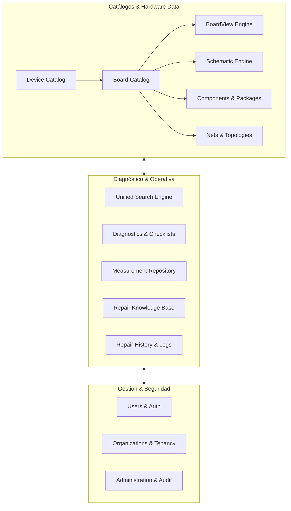

# BoardForge — Product Foundation

---

## 1. Product Vision

**BoardForge** es una plataforma profesional integral diseñada específicamente para técnicos e ingenieros de reparación electrónica, microelectrónica y microsoldadura. Su objetivo fundamental es resolver la fragmentación crítica de información técnica y herramientas de diagnóstico que sufren los laboratorios de reparación a nivel global.

El producto unifica en un único ecosistema colaborativo e intuitivo:
- Catálogo estructurado de dispositivos y revisiones de placas (*motherboards/logic boards*).
- Visores sincronizados e interactivos de esquemáticos (*PDF/Vector*) y *BoardView* (*CAD/BRD/FZZ/etc.*).
- Base de datos relacional de componentes, encapsulados, valores nominales, equivalencias y hojas de datos (*datasheets*).
- Mapeo topológico de líneas de alimentación, señales y líneas de comunicación (*NETs*).
- Registro guiado de mediciones (caída de tensión en escala de diodo, resistencia a tierra, oscilogramas y voltajes en vivo).
- Base de conocimiento técnico, fallas comunes por modelo (*known faults*) y guías procedimentales de reparación paso a paso.
- Trazabilidad e historial de reparaciones por número de serie de placa/dispositivo.
- Gestión multi-tenant para técnicos independientes, equipos y talleres/organizaciones.
- Base fundacional para la futura integración de motores de asistencia de diagnóstico basados en Inteligencia Artificial.

---

## 2. Mission

Construir el estándar de la industria en software de ingeniería inversa asistida, documentación técnica y diagnóstico para reparación electrónica, acelerando los tiempos de reparación, aumentando la tasa de éxito (*success rate*) de los laboratorios y preservando el conocimiento técnico distribuido.

---

## 3. Target Users & Personas

### 3.1. Técnico de Reparación / Aprendiz (Junior / General Technician)
* **Perfil:** Realiza diagnósticos básicos, cambios de módulos, sustitución de componentes pasivos/conectores y busca fallas comunes guiadas.
* **Necesidades:**
  - Búsqueda rápida de fallas típicas asociadas a síntomas específicos (ej. "sin luz de fondo / no backlight", "consumo fijo de 20mA en fuente").
  - Identificación visual clara de componentes en placa y sus valores nominales sin tener que descifrar manualmente esquemáticos complejos de cientos de páginas.
  - Valores de referencia conocidos (ej. caída de tensión en modo diodo de líneas clave) para comparar con su placa bajo prueba.

### 3.2. Técnico Profesional / Microelectrónico (Senior / Microsoldering Specialist)
* **Perfil:** Diagnostica a nivel de silicio, SoC, PMIC, fallas complejas de líneas de datos (I2C, SPI, PCIe), inyección de tensión, reconstrucción de pistas (*pad jumpers*) y reballing avanzado.
* **Necesidades:**
  - Navegación bidireccional instantánea entre *BoardView* y *Schematic* (hacer clic en un pin en el BoardView y saltar inmediatamente a la página y nodo correspondiente del esquemático, y viceversa).
  - Rastreo exhaustivo de líneas (NETs) a través de todas las capas de la placa, conociendo todos los puntos de prueba (*test points*), pads y componentes conectados.
  - Base de datos de componentes equivalentes / sustitutos (*cross-reference*) para chips descontinuados o sin serigrafía comercial.
  - Registro de mediciones precisas y capacidad para documentar nuevas fallas no reportadas previamente.

### 3.3. Administrador de Taller / Lead Engineer
* **Perfil:** Gestiona el equipo técnico, supervisa la calidad de las reparaciones, audita diagnósticos y optimiza los flujos de trabajo.
* **Necesidades:**
  - Control de accesos y roles (RBAC) para el personal del taller.
  - Métricas de efectividad de reparación y trazabilidad de quién diagnosticó/reparó cada dispositivo.
  - Estandarización de protocolos de medición y checklists de control de calidad previos a la entrega.
  - Gestión de inventario de placas donantes y chips recuperables (en fases posteriores).

### 3.4. Organización / Empresa de Reparación Multi-Sede (Multi-tenant Workshop)
* **Perfil:** Cadenas de laboratorios, centros de servicio técnico autorizados o independientes con múltiples sucursales.
* **Necesidades:**
  - Aislamiento estricto de datos privados (historial de clientes, notas internas del taller, base de conocimiento privada).
  - Compartición controlada de esquemáticos/procedimientos propietarios dentro de la organización.
  - Facturación, auditoría de seguridad y cumplimiento normativo (RGPD).

---

## 4. Problem Statement

La reparación electrónica moderna a nivel de componentes se enfrenta a severas ineficiencias estructurales:

1. **Fragmentación Extrema de Herramientas:** Los técnicos operan con múltiples programas obsoletos y desconectados (un visor PDF externo, programas BoardView propietarios antiguos de Windows como OpenBoardView, FlexBV o software chino con graves problemas de seguridad y telemetría no verificada).
2. **Falta de Interactividad Sincronizada:** No existe una plataforma moderna y unificada en la nube/híbrida que enlace en tiempo real el modelo de datos de la placa, el esquemático vectorial y el BoardView interactivo con mediciones de referencia.
3. **Pérdida del Conocimiento Técnico:** El conocimiento de reparación vive en grupos dispersos de mensajería (Telegram, WhatsApp), foros desorganizados o en la memoria individual del técnico. Cuando un técnico resuelve una falla compleja, ese conocimiento rara vez queda estructurado y catalogado para su reutilización inmediata.
4. **Falta de Trazabilidad y Datos de Referencia:** No existe una base de datos centralizada y confiable donde contrastar valores de impedancia / modo diodo / voltajes normales contra mediciones anómalas.
5. **Riesgos de Seguridad:** Muchos programas actuales de BoardView requieren parches inseguros, desactivación de antivirus o binarios no auditados.

---

## 5. Value Proposition

* **Espacio de Trabajo Unificado:** BoardView interactivo, visualizador de esquemáticos, buscador técnico y árbol de NETs en una sola interfaz reactiva y de alto rendimiento.
* **Enlace Bidireccional Inteligente:** Selección sincronizada en tiempo real entre Componente $\leftrightarrow$ Pin $\leftrightarrow$ NET $\leftrightarrow$ Esquemático $\leftrightarrow$ Hoja de Datos.
* **Crowdsourced & Curated Reference Data:** Valores de medición de referencia normalizados (caídas de tensión en modo diodo, resistencias y voltajes) validados por la comunidad y/o organizaciones privadas.
* **Base de Conocimiento Estructurada:** Guías de reparación asociadas a síntomas, placas y componentes específicos, integradas directamente en la vista de trabajo del técnico.
* **Historial de Reparaciones y Trazabilidad:** Registro formal de cada placa intervenida, mediciones registradas, componentes reemplazados y resultado final.
* **Seguridad y Privacidad Empresarial:** Plataforma web moderna, multi-tenant, con RBAC, cumplimiento RGPD y protección integral de archivos confidenciales.

---

## 6. Core Product Modules



### 6.1. Device Catalog
Catálogo jerárquico de dispositivos (ej. Portátiles, Smartphones, Consolas, Placas Industriales) organizados por Fabricante $\rightarrow$ Familia $\rightarrow$ Modelo $\rightarrow$ Variante comercial.

### 6.2. Board Catalog
Información detallada de las placas físicas asociadas a uno o varios dispositivos: Código de placa (ej. `820-00165`, `NM-A311`), fabricante del PCB, revisiones (Rev 1.0, Rev 2.0), capas del PCB (*layer count*) e imágenes de alta resolución en capas (*optical HD photos*).

### 6.3. Schematic Viewer & Engine
Módulo de visualización, indexación y renderizado de esquemáticos electrónicos:
- Indexación de texto vectorial, páginas, bloques funcionales (Power, CPU, RAM, Audio).
- Detección de coordenadas de símbolos, conectores, etiquetas de NETs y tablas de alimentación (*power rails/states*).

### 6.4. BoardView Viewer & Engine
Módulo de renderizado gráfico de alta precisión (WebGL/Canvas/SVG) para visualización de placas:
- Representación de contorno de placa, capas (*Top / Bottom / Inner Layers*), pads, vías, puntos de prueba y serigrafía (*silk screen*).
- Soporte para formatos estándares de la industria (`.brd`, `.bdv`, `.asc`, `.cad`, `.fz`, `.tvw`, etc.) transformados a un esquema JSON canónico optimizado.
- Interacción completa: zoom, rotación, filtrado de capas, volteo en espejo (*flip*), selección de pines y resaltado de NETs conectadas.

### 6.5. Components & Packages
Catálogo de componentes electrónicos vinculados a las placas:
- Designadores de referencia (ej. `R1020`, `C3004`, `U7000`, `Q5410`).
- Tipos y familias (Resistencias, Condensadores, Inductores, Diodos, MOSFETs, CI / ICs, Conectores).
- Valores nominales, tolerancias, tensiones máximas, encapsulados físicos (ej. `0402`, `0805`, `QFN-32`, `BGA-178`) y *datasheets*.
- Sistema de componentes equivalentes y sustitutos viables.

### 6.6. Nets (Redes / Líneas de Interconexión)
Modelado de las conexiones eléctricas de la placa:
- Nombre canónico de la línea (ej. `PPBUS_G3H`, `PP3V3_S5`, `I2C_SDA_SMC`, `GND`).
- Tipo de línea (Alimentación principal, Sub-fuente, Señal de habilitación *Enable*, Bus de datos, Reloj, Tierra).
- Topología de la red: lista de todos los componentes y pines interconectados, puntos de prueba accesibles y recorrido entre capas.

### 6.7. Unified Technical Search
Motor de búsqueda de alto rendimiento capaz de resolver consultas instantáneas por:
- Número de parte o código de componente (ej. `ISL9239`, `CD3215`).
- Nombre de línea / NET (ej. `PPVCC_CPU`, `SMBUS_SMC_5_G3H`).
- Designador de referencia en placa activa.
- Síntoma o código de error (ej. "error 4013", "0.000A", "corto en línea principal").

### 6.8. Diagnostics Module
Flujos de trabajo estructurados para el análisis de fallas:
- Árboles de decisión guiados paso a paso por síntoma.
- Secuencia de encendido (*Power Sequence*) interactiva por modelo de placa: verificación de estados de alimentación ($S5 \rightarrow S4 \rightarrow S3 \rightarrow S0$) y señales de *Power Good* / *Reset*.

### 6.9. Measurements Repository
Registro estructurado de mediciones de referencia y mediciones de campo:
- **Modo Diodo / Impedancia a Tierra:** Valores de caída de tensión en cada pin de conectores y circuitos integrados clave (con polarización inversa respecto a GND).
- **Voltajes en Vivo:** Tensiones esperadas en diferentes estados de funcionamiento (Standby, Encendido, Carga, Batería sola).
- **Formas de Onda / Oscilogramas:** Puntos de osciloscopio de referencia (frecuencias de reloj, señales PWM en bobinas, buses de comunicación).

### 6.10. Repair Knowledge Base
Gestión del conocimiento técnico colaborativo y privado:
- Base de datos de "Fallas Típicas" (*Known Issues*) asociadas a componentes específicos de cada placa.
- Guías de reparación comunitarias y artículos técnicos enriquecidos (con imágenes, microfotografías y soluciones documentadas).
- Sistema de votación, validación técnica por pares y control de versiones de procedimientos.

### 6.11. Repair History & Traceability
Registro detallado de órdenes de trabajo e historial de intervenciones por placa/equipo:
- Identificación por Número de Serie (*Serial Number*), MAC o UUID de placa.
- Registro cronológico: síntoma de ingreso, mediciones iniciales tomadas, componente culpable identificado, sustitución realizada, mediciones finales y garantía.

### 6.12. Users, Organizations & RBAC
- Jerarquía multi-inquilino (*Multi-tenant*): Usuarios individuales $\rightarrow$ Equipos/Talleres $\rightarrow$ Organizaciones empresariales con múltiples sedes.
- Roles estándar: `Global Admin`, `Organization Owner`, `Workshop Manager`, `Senior Technician`, `Junior Technician`, `Viewer/Guest`.
- Políticas de aislamiento estricto de datos privados entre organizaciones.

### 6.13. Administration & Auditing
- Panel de control para gestión de catálogos globales y moderación de contenido comunitario.
- Registro inmutable de eventos de auditoría (*Audit Log*) para acciones de seguridad y operaciones críticas.
- Monitorización de límites de cuota, almacenamiento de archivos y consumo de API.

---

## 7. MVP Scope (Minimum Viable Product)

El MVP se centrará en resolver el flujo principal de valor del técnico con máxima solidez y rendimiento:

```text
[Seleccionar Dispositivo / Placa]
               │
               ▼
[Workspace Unificado: BoardView + Esquemático + Buscador de NETs/Componentes]
               │
               ▼
[Consultar / Registrar Mediciones en Modo Diodo de la Placa]
               │
               ▼
[Consultar Fallas Comunes / Guardar Nota de Reparación Básica]
```

### Incluido en el MVP:
1. **Autenticación y Gestión de Usuarios:** Registro, inicio de sesión seguro, perfiles de usuario y estructura básica de Organización (unipersonal o taller básico).
2. **Device & Board Catalog (Core):** Modelado y visualización del catálogo de dispositivos y placas con soporte para múltiples revisiones.
3. **Visor de BoardView Interactivo (Core Engine):**
   - Importación y parseo de al menos los formatos más extendidos (`.brd` / `.cad` / `.fz`).
   - Renderizado 2D fluido de caras Top y Bottom, zoom continuo, pan, rotación y selección de pines/componentes.
   - Resaltado visual de la NET seleccionada en toda la placa.
4. **Visor de Esquemáticos (Vector PDF / SVG):**
   - Visualización fluida de esquemáticos asociados a la placa.
   - Navegación básica entre menciones de componentes.
5. **Mapeo Básico de Componentes y NETs:**
   - Panel lateral con lista de componentes, pines, designadores y nombres de NETs.
6. **Módulo Básico de Mediciones (Modo Diodo):**
   - Capacidad de visualizar valores de referencia en pines/pads y registrar mediciones tomadas por el técnico.
7. **Base de Conocimiento Inicial:**
   - Registro y consulta de "Fallas Típicas" y notas de reparación vinculadas a la placa.
8. **Motor de Búsqueda Local/Placa:**
   - Búsqueda instantánea por nombre de NET, componente o pin dentro de la placa activa.

---

## 8. Non-Goals (Exclusiones Iniciales)

Para garantizar foco y entrega de alta calidad, **NO** se construirá en las fases iniciales:

1. **NO IA ni Machine Learning en Fase 0/1:** No se implementarán modelos LLM o redes neuronales hasta no contar con el modelo de datos canónico y un volumen estructurado de datos técnicos reales.
2. **NO Sistema ERP/Facturación Completo:** BoardForge es una plataforma de ingeniería y diagnóstico de placas, no un software de contabilidad fiscal, nóminas o TPV para clientes de mostrador.
3. **NO Integración Directa con Hardware / Multímetros en MVP:** No se desarrollarán controladores USB/Bluetooth en tiempo real para instrumentos de laboratorio en la primera versión (se priorizará la captura manual estructurada de mediciones).
4. **NO Editor / Diseñador CAD de PCBs:** BoardForge es una herramienta de visualización, ingeniería inversa y diagnóstico; no compite con Altium Designer, KiCad o Eagle en el diseño de nuevas PCBs.
5. **NO Red Social Pública Desestructurada:** No habrá foros de discusión genéricos tipo red social sin vinculación a una entidad técnica concreta (dispositivo, placa, componente o procedimiento).

---

## 9. Product Principles

1. **Precisión Técnica Absoluta (*Technical Accuracy First*):** Los datos de pines, tensiones, esquemáticos y componentes deben representarse sin ambigüedades. Un error en un pinout o polaridad puede destruir físicamente una placa.
2. **Rendimiento de Interfaz en Tiempo Real (*Zero-Lag Workbench*):** El técnico utiliza la herramienta mientras sostiene sondas de multímetro o el soldador. El zoom, pan, búsqueda y cambio de capas en el BoardView deben responder a 60 FPS sin bloqueos.
3. **Seguridad y Confidencialidad por Diseño (*Security & Privacy by Design*):** Aislamiento estricto de los datos entre talleres y organizaciones. Protección rigurosa de archivos subidos y cumplimiento estricto de estándares OWASP y RGPD.
4. **Modularidad y Desacoplamiento (*Modular Simplicity*):** Cada dominio (BoardView, Esquemático, Catálogo, Mediciones) debe estar claramente delimitado y ser testeable de forma independiente.
5. **Trazabilidad Inmutable (*Auditability & Traceability*):** Cada cambio en esquemas, mediciones de referencia o procedimientos debe tener un autor, una fecha y un control de versiones claro.
6. **Evolutividad hacia Asistencia Inteligente (*AI-Ready Data Architecture*):** Toda la información de diagnósticos, componentes y secuencias de encendido debe almacenarse en formatos normalizados y fuertemente tipados para permitir su consumo futuro por agentes de IA.

---

## 10. Future Vision

* **Asistente de Diagnóstico con IA (BoardForge Copilot):** Razonamiento automatizado sobre el esquemático y las mediciones del usuario para sugerir componentes sospechosos en base a síntomas y árboles de secuencias.
* **Integración IoT con Instrumentación de Laboratorio:** Conexión vía WebUSB/Bluetooth/SCPI con multímetros inteligentes, fuentes de alimentación reguladas y osciloscopios para volcado automático de mediciones en tiempo real.
* **Inspección Óptica Asistida por Visión Artificial (CV):** Superposición de imágenes térmicas (*Thermal Cam Overlay*) y fotos de microscopio de alta resolución directamente alineadas sobre el BoardView.
* **Marketplace de Placas Donantes y Componentes Raros:** Red B2B entre laboratorios para localización y compra de circuitos integrados descatalogados y placas donantes.
* **API Pública & SDK de Integración:** Integración con sistemas de gestión de taller externos (RepairDesk, Fixerbee, etc.).

---

## 11. Open Decisions

| ID | Área | Descripción de la Decisión Abierta | Opciones Consideradas |
|---|---|---|---|
| `OD-PROD-001` | Visor BoardView | Elección del motor de renderizado gráfico para el cliente web de BoardView. | (A) WebGL / Three.js nativo; (B) HTML5 2D Canvas optimizado; (C) PixiJS / Konva.js. |
| `OD-PROD-002` | Procesamiento de Archivos | Estrategia de parseo de archivos BoardView propietarios (`.brd`, `.cad`, `.fz`). | (A) Parseo en backend a JSON canónico BoardForge; (B) Parseo en WebAssembly / Worker en el cliente; (C) Híbrido. |
| `OD-PROD-003` | Visor Esquemático | Método de renderizado y vinculación interactiva de esquemáticos PDF/Vectoriales. | (A) Conversión a SVG interactivo con capas semánticas; (B) PDF.js con capa de overlay semántico de coordenadas; (C) Renderizado vectorial rasterizado por tiles. |
| `OD-PROD-004` | Modelo de Contenido | Estrategia de gobernanza para catálogos y mediciones públicas vs. privadas. | (A) Modelo Wiki con moderación comunitaria estricta; (B) Catálogo base gestionado exclusivamente por administradores + extensiones privadas de organización; (C) Modelo híbrido con reputación técnica. |
