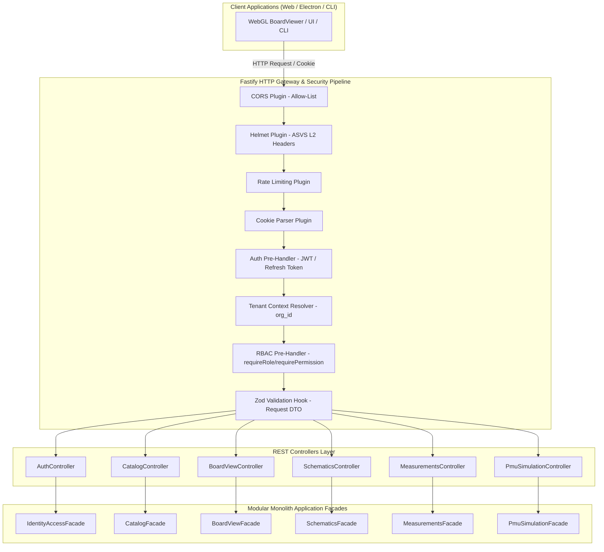
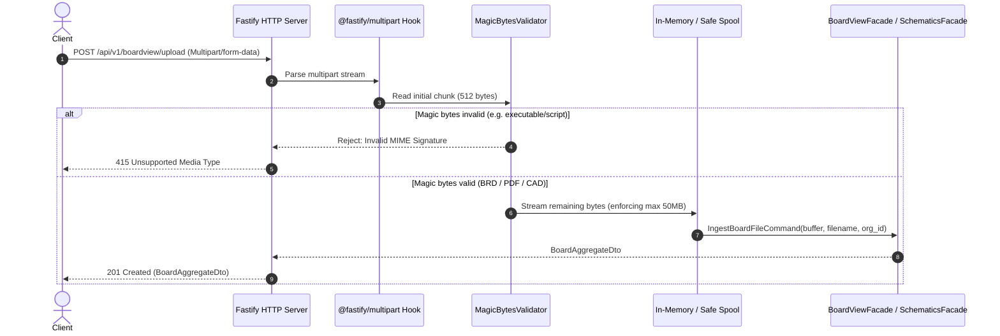

# Technical Design: `http-api-endpoints`

**Change ID:** `http-api-endpoints`  
**Target Subsystems:** `src/interfaces/http`, `src/modules/identity-access`, `src/modules/*`  
**Security Standard:** OWASP ASVS Level 2, RFC 7807 Problem Details, RFC 6749 / RFC 7519  

---

## 1. Architectural Overview & Presentation Layer

The HTTP REST layer serves as the primary interface adapter in BoardForge's Clean / Hexagonal Architecture. It translates HTTP requests into strongly typed Application Commands and Queries, coordinates with module application facades, and maps domain responses or exceptions into standardized HTTP representations (JSON DTOs, RFC 7807 Problem Details).



---

## 2. Domain Entities & Value Objects (Identity & Access)

### 2.1. Domain Entities
* **`User` (Aggregate Root):**
  * `id`: `UserId` (UUIDv4)
  * `organization_id`: `OrganizationId` (UUIDv4)
  * `email`: `Email` (Value Object, validated RFC 5322)
  * `password_hash`: `PasswordHash` (Value Object, Argon2id)
  * `role`: `UserRole` (`Admin`, `LeadTech`, `Tech`, `Viewer`)
  * `is_active`: `boolean`
  * `created_at` / `updated_at`: `Date`
* **`Organization` (Tenant Aggregate):**
  * `id`: `OrganizationId` (UUIDv4)
  * `slug`: `string`
  * `name`: `string`
  * `plan`: `TenantPlan` (`Community`, `ProShop`, `Enterprise`)
  * `storage_quota_bytes`: `bigint`
* **`Session` (Entity):**
  * `id`: `SessionId` (UUIDv4)
  * `user_id`: `UserId`
  * `refresh_token_hash`: `string` (SHA-256 hash of opaque token)
  * `expires_at`: `Date`
  * `revoked_at`: `Date | null`
  * `user_agent`: `string`
  * `ip_address`: `string`

### 2.2. Value Objects
* **`TenantContext`:**
  ```typescript
  export class TenantContext {
    constructor(
      public readonly organizationId: string,
      public readonly userId: string,
      public readonly role: UserRole,
      public readonly permissions: ReadonlySet<string>
    ) {}
  }
  ```
* **`TokenPair`:**
  ```typescript
  export interface TokenPair {
    accessToken: string;
    refreshToken: string;
    expiresInSeconds: number;
  }
  ```

---

## 3. Security Architecture (OWASP ASVS L2 Hardening)

### 3.1. Authentication Flow & Token Lifecycle
1. **Login (`POST /api/v1/auth/login`):**
   * Verifies email + password against Argon2id hash.
   * Generates a short-lived Access Token (JWT, 15m lifetime) containing `sub`, `org_id`, `role`, and `jti`.
   * Generates a 256-bit opaque Refresh Token (7 days lifetime), hashes it via SHA-256, and saves the session in DB.
   * Attaches two `HttpOnly`, `Secure`, `SameSite=Strict`, `Path=/` cookies: `bf_access_token` and `bf_refresh_token`.
2. **Silent Token Refresh (`POST /api/v1/auth/refresh`):**
   * Reads `bf_refresh_token` cookie.
   * Hashes token and looks up session in DB.
   * **Replay Detection:** If session is already revoked or replaced, immediately revokes ALL active sessions for that user and clears cookies (alerting potential token theft).
   * If valid: issues new `TokenPair`, rotates Refresh Token, updates session hash, and sets new cookies.
3. **Logout (`POST /api/v1/auth/logout`):**
   * Marks session as revoked in DB and clears auth cookies (`Max-Age=0`).

### 3.2. RBAC & Multi-Tenancy Resolution Pipeline
* Fastify hook `onRequest` executes `authenticateUser`:
  * Extracts JWT from `bf_access_token` cookie (or fallback `Authorization: Bearer <token>`).
  * Decodes and verifies signature.
  * Injects `req.tenantContext = new TenantContext(org_id, sub, role, permissions)`.
* Route pre-handler `requireRole(['Admin', 'LeadTech'])`:
  * Checks if `req.tenantContext.role` is in the allowed roles. If not, throws `ForbiddenError` (HTTP 403).
* Repositories automatically enforce `organization_id = req.tenantContext.organizationId` for all non-global catalog entities.

---

## 4. Centralized RFC 7807 Error Handling

All domain, validation, and transport exceptions are mapped to the RFC 7807 Problem Details schema:

```json
{
  "type": "https://boardforge.io/errors/invalid-parameter",
  "title": "Invalid Request Parameters",
  "status": 400,
  "detail": "Field 'reading_mv' must be a positive number.",
  "instance": "/api/v1/measurements/records",
  "invalidParams": [
    {
      "name": "reading_mv",
      "reason": "Expected number, received string"
    }
  ]
}
```

### Domain to HTTP Status Mapping:
* `EntityNotFoundError` $\rightarrow$ `404 Not Found` (`https://boardforge.io/errors/not-found`)
* `UnauthorizedError` $\rightarrow$ `401 Unauthorized` (`https://boardforge.io/errors/unauthorized`)
* `ForbiddenError` $\rightarrow$ `403 Forbidden` (`https://boardforge.io/errors/forbidden`)
* `DomainValidationError` / `ZodError` $\rightarrow$ `400 Bad Request` (`https://boardforge.io/errors/validation`)
* `ConflictError` $\rightarrow$ `409 Conflict` (`https://boardforge.io/errors/conflict`)
* `UnsupportedMediaTypeError` $\rightarrow$ `415 Unsupported Media Type` (`https://boardforge.io/errors/unsupported-media-type`)
* `RateLimitExceededError` $\rightarrow$ `429 Too Many Requests` (`https://boardforge.io/errors/rate-limit`)
* `InternalError` / unexpected $\rightarrow$ `500 Internal Server Error` (`https://boardforge.io/errors/internal`)

---

## 5. Secure Multipart File Upload Pipeline



### Supported Magic Byte Signatures:
* **PDF (Schematics):** `0x25 0x50 0x44 0x46 0x2D` (`%PDF-`)
* **BoardView (BRD / BDV):** Text headers `[format]` or binary header `BRD` / custom magic headers.
* **ZIP / Encrypted Archives:** `0x50 0x4B 0x03 0x04` (only if supported variant package).

---

## 6. HTTP REST API Endpoint Specification

### 6.1. Auth & IAM Routes (`/api/v1/auth`)
| Method | Path | Auth | Roles | Description |
| :--- | :--- | :--- | :--- | :--- |
| `POST` | `/api/v1/auth/register` | Public | None | Register a new tenant organization + admin user |
| `POST` | `/api/v1/auth/login` | Public | None | Authenticate with email/password; issue HttpOnly cookies |
| `POST` | `/api/v1/auth/refresh` | Cookie | All | Silent token rotation using refresh token cookie |
| `POST` | `/api/v1/auth/logout` | Cookie/JWT | All | Revoke session and clear cookies |
| `GET` | `/api/v1/auth/me` | JWT | All | Get current authenticated user profile & tenant context |

### 6.2. Hardware Catalog Routes (`/api/v1/catalog`)
| Method | Path | Auth | Roles | Description |
| :--- | :--- | :--- | :--- | :--- |
| `GET` | `/api/v1/catalog/devices` | JWT | Viewer+ | List all device models (e.g., iPhone 13, iPad Pro) with pagination |
| `GET` | `/api/v1/catalog/devices/:id` | JWT | Viewer+ | Get device model and linked composite board hierarchy |
| `POST` | `/api/v1/catalog/devices` | JWT | LeadTech+ | Register a custom device model |
| `GET` | `/api/v1/catalog/boards/:id` | JWT | Viewer+ | Get composite board aggregate with child sub-boards |

### 6.3. BoardView Routes (`/api/v1/boardview`)
| Method | Path | Auth | Roles | Description |
| :--- | :--- | :--- | :--- | :--- |
| `POST` | `/api/v1/boardview/upload` | JWT | LeadTech+ | Multipart file upload for `.brd` / `.fz` / `.cad` files |
| `GET` | `/api/v1/boardview/:board_id` | JWT | Viewer+ | Get full canonical board geometry (outlines, components, pins, nets) |
| `GET` | `/api/v1/boardview/:board_id/nets` | JWT | Viewer+ | Query netlist with optional search filtering |
| `GET` | `/api/v1/boardview/:board_id/nets/:net_name` | JWT | Viewer+ | Get specific net connected pins across sub-boards |

### 6.4. Schematics Cross-Probing Routes (`/api/v1/schematics`)
| Method | Path | Auth | Roles | Description |
| :--- | :--- | :--- | :--- | :--- |
| `POST` | `/api/v1/schematics/upload` | JWT | LeadTech+ | Multipart upload of PDF schematic with asynchronous symbol indexing |
| `GET` | `/api/v1/schematics/:schematic_id/search` | JWT | Viewer+ | Search symbols/nets in PDF with page numbers and bounding box coordinates |
| `GET` | `/api/v1/schematics/:schematic_id/pages/:page_number` | JWT | Viewer+ | Get vector/render metadata for a specific schematic page |

### 6.5. Diode Mode Measurements Routes (`/api/v1/measurements`)
| Method | Path | Auth | Roles | Description |
| :--- | :--- | :--- | :--- | :--- |
| `GET` | `/api/v1/measurements/references` | JWT | Viewer+ | Query reference diode readings for board/pads under specific physical state |
| `POST` | `/api/v1/measurements/references` | JWT | LeadTech+ | Register or update baseline diode measurements |
| `POST` | `/api/v1/measurements/records` | JWT | Tech+ | Submit technician live multimeter reading and receive immediate Pass/Fail evaluation |

### 6.6. PMU Power Sequence Simulation Routes (`/api/v1/pmu`)
| Method | Path | Auth | Roles | Description |
| :--- | :--- | :--- | :--- | :--- |
| `GET` | `/api/v1/pmu/sequence` | JWT | Tech+ | Simulate PMU power-up rail sequence ladder for a given board and trigger condition |

---

## 7. File Change Layout

```text
src/
├── interfaces/
│   └── http/
│       ├── app.ts                         # Fastify application factory & plugin registration
│       ├── server.ts                      # Server listener entry point
│       ├── plugins/
│       │   ├── security-headers.plugin.ts # Helmet ASVS L2 security headers
│       │   ├── cors.plugin.ts             # Origin allow-list CORS configuration
│       │   ├── rate-limit.plugin.ts       # Rate limiting rules & handlers
│       │   ├── auth.plugin.ts             # JWT & Cookie authentication pre-handler
│       │   ├── rbac.plugin.ts             # Role-based access control hooks
│       │   └── error-handler.plugin.ts    # RFC 7807 Problem Details serialization
│       ├── middlewares/
│       │   ├── tenant-resolver.ts         # Multi-tenant context extraction
│       │   └── magic-bytes-validator.ts   # Binary file MIME verification
│       ├── routes/
│       │   ├── v1/
│       │   │   ├── index.ts               # V1 router aggregation
│       │   │   ├── auth.routes.ts         # /api/v1/auth routes
│       │   │   ├── catalog.routes.ts      # /api/v1/catalog routes
│       │   │   ├── boardview.routes.ts    # /api/v1/boardview routes
│       │   │   ├── schematics.routes.ts   # /api/v1/schematics routes
│       │   │   ├── measurements.routes.ts # /api/v1/measurements routes
│       │   │   └── pmu.routes.ts          # /api/v1/pmu routes
│       ├── controllers/
│       │   ├── auth.controller.ts
│       │   ├── catalog.controller.ts
│       │   ├── boardview.controller.ts
│       │   ├── schematics.controller.ts
│       │   ├── measurements.controller.ts
│       │   └── pmu.controller.ts
│       ├── dtos/
│       │   ├── auth.dto.ts
│       │   ├── catalog.dto.ts
│       │   ├── boardview.dto.ts
│       │   ├── schematics.dto.ts
│       │   ├── measurements.dto.ts
│       │   └── pmu.dto.ts
│       └── validators/
│           └── zod-schemas.ts             # Reusable Zod schemas & strict parsers
tests/
└── interfaces/
    └── http/
        ├── auth.e2e.test.ts               # Login, refresh token rotation, logout tests
        ├── security-headers.test.ts       # ASVS L2 headers & CORS verification
        ├── rate-limit.test.ts             # Sliding window throttling tests
        ├── multi-tenancy.test.ts          # IDOR prevention & tenant scoping tests
        ├── rbac-permissions.test.ts       # Role hierarchy enforcement tests
        ├── multipart-upload.test.ts       # Magic bytes & file upload rejection tests
        ├── catalog-api.test.ts            # Catalog REST endpoints
        ├── boardview-api.test.ts          # BoardView REST endpoints
        ├── schematics-api.test.ts         # Schematics REST endpoints
        ├── measurements-api.test.ts       # Measurements REST endpoints
        └── pmu-api.test.ts                # PMU simulation REST endpoints
```

---

## 8. Test Harness Strategy

We utilize Fastify's built-in `fastify.inject()` (`light-my-request`) test runner integrated with `vitest`. This enables:
1. **Zero Network Latency:** Requests are injected directly into the Fastify pipeline without opening TCP sockets.
2. **Full Lifecycle Execution:** Tests exercise all hooks (`onRequest`, `preValidation`, `preHandler`, `handler`, `onError`), ensuring 100% coverage of auth cookies, security headers, rate limiters, and Zod validators.
3. **Deterministic Mocking:** Application facades are injected via dependency injection or factory functions, isolating HTTP testing from database or heavy PDF rendering engines.
