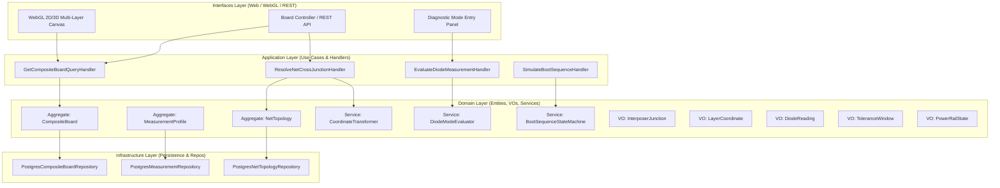
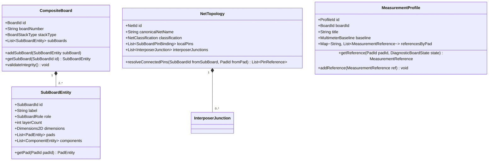
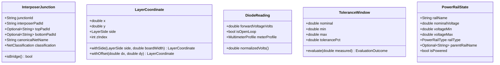
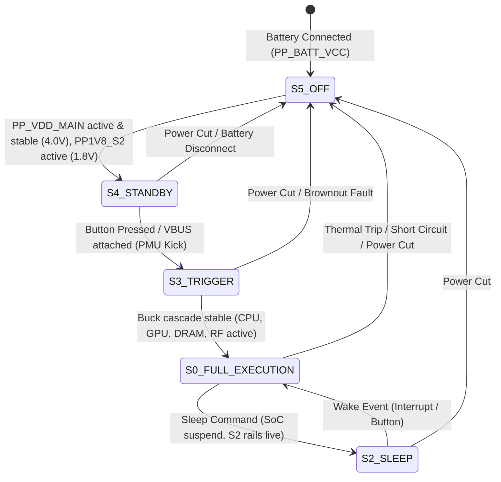

# Technical Design Document: `iphone13-board-core`

**Change ID:** `iphone13-board-core`  
**Status:** Approved / In Design  
**Target Subsystems:** `catalog`, `boardview`, `measurements`, `schematics`  
**Device Scope:** Apple iPhone 13 (A2482, A2631, A2633, A2634, A2635 / Logic Board 820-02106)  
**Standard:** Clean Architecture / Hexagonal Ports & Adapters / Tactical Domain-Driven Design (DDD)  

---

## 1. Executive Summary & Architectural Overview

The `iphone13-board-core` change introduces the foundational multi-layer composite board architecture into BoardForge. Modern high-density smartphone logic boards (such as Apple's iPhone 13 logic board `820-02106`) depart from flat, single-PCB designs by employing stacked multi-board sandwich structures joined along the perimeter by a castellated interposer ring.

This technical design document specifies:
1. **Tactical DDD Model**: Aggregate roots (`CompositeBoard`, `NetTopology`, `MeasurementProfile`), entities, and immutable Value Objects (`InterposerJunction`, `LayerCoordinate`, `DiodeReading`, `ToleranceWindow`, `PowerRailState`).
2. **Core Domain Services**:
   - `CoordinateTransformer`: Floating-point deterministic coordinate transformations (horizontal flip, viewport offset, exploded 3D z-stacking).
   - `DiodeModeEvaluator`: Multimeter calibration normalization and tolerance evaluation (`PASS`, `WARNING_DEVIATION`, `CRITICAL_LOW_OR_SHORT`, `OPEN_LINE_OL`).
   - `BootSequenceStateMachine`: PMU state sequence enforcement (`S5_OFF` $\rightarrow$ `S4_STANDBY` $\rightarrow$ `S3_TRIGGER` $\rightarrow$ `S0_FULL_EXECUTION` with sleep `S2_SLEEP`).
3. **Architecture Decisions & Rationale (ADRs)**.
4. **Source Code File Layout** adhering to Clean Architecture inside `src/`.
5. **Strict TDD Testing Strategy Matrix** matching all OpenSpec requirements.



---

## 2. Domain-Driven Design (DDD) Model

### 2.1. Domain Aggregate Roots & Entities



#### 1. `CompositeBoard` (Aggregate Root — `catalog` / `boardview`)
- **Identity:** `BoardId` (e.g., `BRD_820_02106`).
- **Invariants:**
  - When `stackType == SANDWICH_INTERPOSER`, subBoards count MUST be $\ge 2$ (typically `TOP_LOGIC`, `INTERPOSER_FRAME`, `BOTTOM_RF`).
  - No two child sub-boards may have duplicate `SubBoardId` values.
  - Sub-board physical dimensions and layer counts must be positive integers.

#### 2. `NetTopology` (Aggregate Root — `boardview` / `schematics`)
- **Identity:** `NetId` (e.g., `NET_PP_VDD_MAIN_820_02106`).
- **Invariants:**
  - Maintains the canonical cross-board name (e.g. `PP_VDD_MAIN`) and aliases on each sub-board (`PP_VDD_RF_MAIN` on RF sub-board).
  - Encapsulates bidirectional resolution between component pins and interposer pads.

#### 3. `MeasurementProfile` (Aggregate Root — `measurements`)
- **Identity:** `ProfileId`.
- **Invariants:**
  - Scoped to a specific `BoardId` and default `MultimeterBaseline` (e.g., `FLUKE_115_STANDARD`).
  - Contains immutable reference measurement collections indexed by `PadId` and `DiagnosticBoardState`.

---

### 2.2. Value Objects

All Value Objects are strictly immutable, side-effect free, and compared by structural equality.



1. **`InterposerJunction`**:
   - `junctionId`: Unique string identifier (e.g., `JUNC_084`).
   - `interposerPadId`: Solder ring perimeter pad/ball (e.g., `INT_PAD_084`).
   - `topPadId`: Associated pad on Top AP board (e.g., `TOP_U2700_A12`), or empty.
   - `bottomPadId`: Associated pad on Bottom RF board (e.g., `BOT_UBBPMU_C4`), or empty.
   - `canonicalNetName`: Primary system bus name (`PP_VDD_MAIN`).
   - `classification`: `POWER_MAIN`, `POWER_BUCK`, `SIGNAL_I2C`, `SIGNAL_SPI`, `RF_ANTENNA`, `GROUND`.

2. **`LayerCoordinate`**:
   - `x`: Cartesian X position in millimeters ($mm$, precision $\pm 0.0001\text{ mm}$).
   - `y`: Cartesian Y position in millimeters ($mm$).
   - `side`: `TOP_SIDE` (A-side) or `BOTTOM_SIDE` (B-side).
   - `zIndex`: Physical layer index (0 for Top, 1 for Interposer, 2 for Bottom).

3. **`DiodeReading`**:
   - `forwardVoltageVolts`: Measured $V_f$ drop (0.000V to 3.000V).
   - `isOpenLoop`: Boolean indicating high-impedance / Open Loop (`OL`).
   - `meterProfile`: Multimeter calibration specification (`scaleFactor`, `offsetVolts`).

4. **`ToleranceWindow`**:
   - `nominal`: Standard expected reference value in Volts.
   - `min`: Lower limit (e.g., $V_{\text{nominal}} \times (1 - \text{tolerance})$).
   - `max`: Upper limit (e.g., $V_{\text{nominal}} \times (1 + \text{tolerance})$).
   - `tolerancePct`: Configured tolerance percentage (default: 7.0%).

5. **`PowerRailState`**:
   - `railName`: System power rail name (e.g., `PP_VDD_MAIN`, `PP1V8_S2`, `PP_VDD_CPU_CORE`).
   - `nominalVoltage`, `voltageMin`, `voltageMax`.
   - `railType`: `PRIMARY_BUS`, `BOOST`, `ALWAYS_ON_S2`, `CORE_BUCK`, `LDO_SWITCHED`.
   - `parentRailName`: Parent power provider in power tree.

---

## 3. Core Domain Services & Algorithms

### 3.1. `CoordinateTransformer` (Deterministic Pure Geometric Math)

```typescript
export class CoordinateTransformer {
  /**
   * Flips X coordinate across the vertical centerline when viewing B-side (bottom).
   * Formula: X_mirrored = boardWidth - X_original
   */
  public static flipHorizontal(coord: LayerCoordinate, boardWidth: number): LayerCoordinate {
    if (coord.side === LayerSide.BOTTOM_SIDE) {
      return coord; // already flipped
    }
    return new LayerCoordinate(
      roundPrecision(boardWidth - coord.x, 4),
      coord.y,
      LayerSide.BOTTOM_SIDE,
      coord.zIndex
    );
  }

  /**
   * Translates 2D coordinates for viewport alignment or exploded layout.
   */
  public static translate(coord: LayerCoordinate, offsetX: number, offsetY: number): LayerCoordinate {
    return new LayerCoordinate(
      roundPrecision(coord.x + offsetX, 4),
      roundPrecision(coord.y + offsetY, 4),
      coord.side,
      coord.zIndex
    );
  }

  /**
   * 3D Exploded multi-layer translation with stacking delta.
   */
  public static stackTransform(coord: LayerCoordinate, layerSpacingZ: number): { x: number; y: number; z: number } {
    return {
      x: coord.x,
      y: coord.y,
      z: coord.zIndex * layerSpacingZ,
    };
  }
}
```

---

### 3.2. `DiodeModeEvaluator` (Meter Normalization & Diode Validation)

```mermaid
flowchart TD
    START([Input: Measured Vf, MeterProfile, Reference]) --> NORM[Apply Calibration Normalization]
    NORM --> CHECK_OL{Is Reading OL or Vf >= 2.500V?}
    CHECK_OL -- Yes --> CHECK_REF_OL{Is Reference Expected OL?}
    CHECK_REF_OL -- Yes --> PASS_OL[Result: PASS]
    CHECK_REF_OL -- No --> RES_OL[Result: OPEN_LINE_OL]
    
    CHECK_OL -- No --> CHECK_SHORT{Is Normalized Vf <= 0.050V or >= 50% below nominal?}
    CHECK_SHORT -- Yes --> RES_SHORT[Result: CRITICAL_LOW_OR_SHORT]
    
    CHECK_SHORT -- No --> CHECK_PASS{Within [Vmin, Vmax]?}
    CHECK_PASS -- Yes --> RES_PASS[Result: PASS]
    CHECK_PASS -- No --> CHECK_WARN{Within 1.0x to 1.5x of Tolerance?}
    CHECK_WARN -- Yes --> RES_WARN[Result: WARNING_DEVIATION]
    CHECK_WARN -- No --> RES_CRIT[Result: CRITICAL_LOW_OR_SHORT / UNEXPECTED_HIGH]
```

**Normalization Formula:**
$$V_{f,\text{normalized}} = V_{f,\text{measured}} \times \text{scale\_factor} + \text{offset\_volts}$$

**Evaluation Algorithm:**
- If $V_{f,\text{normalized}} \le 0.050\text{ V}$ and $V_{\text{nominal}} > 0.100\text{ V}$: `CRITICAL_LOW_OR_SHORT`.
- If $V_{f,\text{normalized}} \ge 2.500\text{ V}$ or marked `OL` when $V_{\text{nominal}}$ is active: `OPEN_LINE_OL`.
- If $V_{\min} \le V_{f,\text{normalized}} \le V_{\max}$: `PASS`.
- If deviation is within $1.0\times$ to $1.5\times$ threshold: `WARNING_DEVIATION`.

---

### 3.3. `BootSequenceStateMachine` (PMU State Machine)



**State Invariants:**
- `S5_OFF`: Only `PP_BATT_VCC` active.
- `S4_STANDBY`: `PP_VDD_MAIN` $\ge 3.7\text{V}$, `PP1V8_S2` $= 1.8\text{V}$.
- `S3_TRIGGER`: Transient state initiating PMU buck regulator enable signals.
- `S2_SLEEP`: `PP_VDD_MAIN` and `PP1V8_S2` active; Core Bucks (`PP_VDD_CPU_CORE`, `PP_VDD_GPU`) inactive.
- `S0_FULL_EXECUTION`: All parent and child rails in `PowerTree` powered within nominal tolerance.
- Transitions must follow legal paths; invalid jumps (e.g. `S5_OFF` $\rightarrow$ `S0_FULL_EXECUTION`) throw `IllegalStateTransitionException`.

---

## 4. Architecture Decisions & Rationale (ADRs)

### ADR-001: Hierarchical Composite Board Model vs. Single Flat Board
- **Status:** Approved.
- **Context:** Mobile PCBs like iPhone 13 are physical multi-layer sandwiches with independent component coordinate systems on both sides of each sub-board.
- **Decision:** Model hardware as a `CompositeBoardAggregate` containing child `SubBoardEntity` items and explicit `InterposerJunction` links.
- **Rationale:** Prevents coordinate collisions, allows isolated rendering of Top AP vs Bottom RF boards, and enables precise multi-state diode mode indexing.

### ADR-002: Pure Value Objects for Geometric Transformations
- **Status:** Approved.
- **Context:** Coordinate mirroring and viewport transformations must run identically in backend net resolvers and frontend WebGL render loops without drift.
- **Decision:** Implement `CoordinateTransformer` and `LayerCoordinate` as pure, immutable mathematical structures with rounding precision ($0.0001\text{ mm}$).
- **Rationale:** Ensures deterministic cross-probing and 100% unit-testable math with no DOM or framework dependencies.

### ADR-003: Calibrated Multimeter Normalization
- **Status:** Approved.
- **Context:** Technicians in repair shops use multimeters with different constant test currents (0.5mA vs 1.0mA), yielding 20mV–80mV differences on the same silicon PN junction.
- **Decision:** Store baseline reference data against a standard benchmark (`FLUKE_115_STANDARD`) and normalize user readings via `MultimeterProfile` scaling and offsets before validation.
- **Rationale:** Eliminates false-positive diagnostics and standardizes crowdsourced measurement repositories across repair tools.

---

## 5. File Change & Directory Layout

Following Clean Architecture and Modular Monolith principles:

```text
src/
├── domain/
│   ├── catalog/
│   │   ├── entities/
│   │   │   ├── CompositeBoard.ts
│   │   │   └── SubBoardEntity.ts
│   │   ├── value-objects/
│   │   │   ├── BoardId.ts
│   │   │   ├── SubBoardId.ts
│   │   │   └── BoardStackType.ts
│   │   ├── exceptions/
│   │   │   └── DuplicateSubBoardIdException.ts
│   │   └── repositories/
│   │       └── ICompositeBoardRepository.ts
│   ├── boardview/
│   │   ├── entities/
│   │   │   ├── PadEntity.ts
│   │   │   └── ComponentEntity.ts
│   │   ├── value-objects/
│   │   │   ├── InterposerJunction.ts
│   │   │   ├── LayerCoordinate.ts
│   │   │   ├── LayerSide.ts
│   │   │   └── NetClassification.ts
│   │   ├── services/
│   │   │   ├── CoordinateTransformer.ts
│   │   │   └── BidirectionalNetResolver.ts
│   │   └── repositories/
│   │       └── INetTopologyRepository.ts
│   ├── measurements/
│   │   ├── entities/
│   │   │   ├── MeasurementProfile.ts
│   │   │   └── MeasurementReference.ts
│   │   ├── value-objects/
│   │   │   ├── DiagnosticBoardState.ts
│   │   │   ├── DiodeReading.ts
│   │   │   ├── MultimeterProfile.ts
│   │   │   ├── ToleranceWindow.ts
│   │   │   └── EvaluationOutcome.ts
│   │   ├── services/
│   │   │   └── DiodeModeEvaluator.ts
│   │   └── repositories/
│   │       └── IMeasurementRepository.ts
│   └── schematics/
│       ├── entities/
│       │   ├── PowerTree.ts
│       │   └── PowerRailNode.ts
│       ├── value-objects/
│       │   ├── PowerRailState.ts
│       │   ├── PowerSequenceState.ts
│       │   └── PowerRailType.ts
│       ├── services/
│       │   └── BootSequenceStateMachine.ts
│       └── exceptions/
│           └── IllegalStateTransitionException.ts
├── application/
│   ├── catalog/
│   │   ├── queries/
│   │   │   └── GetCompositeBoardHandler.ts
│   │   └── dtos/
│   │       └── CompositeBoardDto.ts
│   ├── boardview/
│   │   ├── queries/
│   │   │   └── ResolveNetCrossJunctionHandler.ts
│   │   └── dtos/
│   │       └── NetResolutionDto.ts
│   ├── measurements/
│   │   ├── commands/
│   │   │   └── EvaluateDiodeMeasurementHandler.ts
│   │   └── dtos/
│   │       └── DiodeEvaluationResultDto.ts
│   └── schematics/
│       ├── commands/
│       │   └── SimulateBootSequenceHandler.ts
│       └── dtos/
│           └── BootSequenceResultDto.ts
├── infrastructure/
│   ├── persistence/
│   │   ├── postgres/
│   │   │   ├── PostgresCompositeBoardRepository.ts
│   │   │   ├── PostgresNetTopologyRepository.ts
│   │   │   └── PostgresMeasurementRepository.ts
│   │   └── in-memory/
│   │       └── InMemoryCompositeBoardRepository.ts
│   └── seeds/
│       └── iPhone13_820_02106_Seed.ts
└── interfaces/
    └── http/
        ├── controllers/
        │   ├── CompositeBoardController.ts
        │   ├── DiodeMeasurementController.ts
        │   └── PowerSequenceController.ts
        └── routes/
            └── apiRouter.ts
```

---

## 6. Strict TDD Testing Strategy

| Test Suite / Path | Target Component | Test Case / Scenario Description | Expected Outcome |
|---|---|---|---|
| `tests/unit/domain/catalog/CompositeBoard.spec.ts` | `CompositeBoard` | Create iPhone 13 composite board aggregate with 3 sub-boards (Top, Interposer, Bottom) | Aggregate initialized with 3 sub-boards in correct order |
| `tests/unit/domain/catalog/CompositeBoard.spec.ts` | `CompositeBoard` | Add two sub-boards with identical `SubBoardId` | Throws `DuplicateSubBoardIdException` |
| `tests/unit/domain/boardview/CoordinateTransformer.spec.ts` | `CoordinateTransformer` | `flipHorizontal` on Pad X=15.25, boardWidth=60.0 mm | Resulting X = 44.75 mm, Y unaltered |
| `tests/unit/domain/boardview/CoordinateTransformer.spec.ts` | `CoordinateTransformer` | `translate` with delta dx=+10.0, dy=-5.0 | New `LayerCoordinate` with exact offset |
| `tests/unit/domain/boardview/BidirectionalNetResolver.spec.ts` | `BidirectionalNetResolver` | Resolve net from Top Pin `U2700.A12` through Interposer `PAD_84` to Bottom `U_BB_PMU.C4` | Returns canonical `PP_VDD_MAIN` and all connected pins |
| `tests/unit/domain/measurements/DiodeModeEvaluator.spec.ts` | `DiodeModeEvaluator` | Reading 0.418V on nominal 0.425V $\pm 7\%$ in `SPLIT_TOP` | Returns `EvaluationOutcome.PASS` with deviation -1.65% |
| `tests/unit/domain/measurements/DiodeModeEvaluator.spec.ts` | `DiodeModeEvaluator` | Reading 0.012V on active rail nominal 0.425V | Returns `EvaluationOutcome.CRITICAL_LOW_OR_SHORT` |
| `tests/unit/domain/measurements/DiodeModeEvaluator.spec.ts` | `DiodeModeEvaluator` | Reading "OL" (or 2.999V) on expected pull-up rail | Returns `EvaluationOutcome.OPEN_LINE_OL` |
| `tests/unit/domain/measurements/DiodeModeEvaluator.spec.ts` | `DiodeModeEvaluator` | Normalization of `SUNSHINE_DT17N` reading (0.380V + 0.035V offset) | Evaluates normalized 0.415V as `PASS` |
| `tests/unit/domain/schematics/BootSequenceStateMachine.spec.ts` | `BootSequenceStateMachine` | Valid progression `S5_OFF` $\rightarrow$ `S4_STANDBY` $\rightarrow$ `S3_TRIGGER` $\rightarrow$ `S0_FULL_EXECUTION` | Correct state transitions and rail activations |
| `tests/unit/domain/schematics/BootSequenceStateMachine.spec.ts` | `BootSequenceStateMachine` | Illegal jump `S5_OFF` $\rightarrow$ `S0_FULL_EXECUTION` | Throws `IllegalStateTransitionException` |
| `tests/unit/domain/schematics/PowerTree.spec.ts` | `PowerTree` | Evaluate child rail `PP_VDD_BOOST` when parent `PP_VDD_MAIN` is 0.0V (FAULT) | Asserts child rail MUST be unpowered with parent fault flag |
| `tests/integration/application/GetCompositeBoardHandler.spec.ts` | Application Query | Load full iPhone 13 board aggregate via repository | Returns composite DTO with all sub-boards, pads, and nets |
