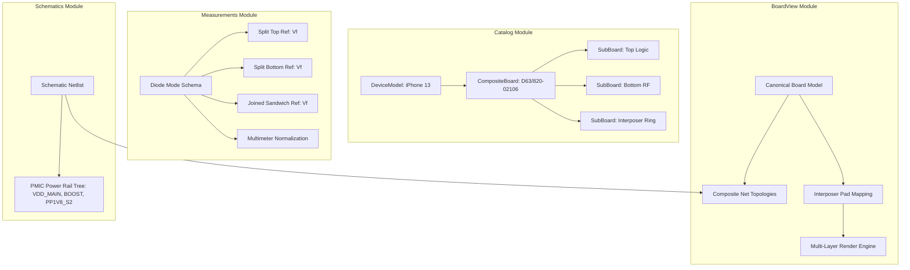

# Change Proposal: `iphone13-board-core`

**Status:** Proposed / Exploration Complete  
**Change ID:** `iphone13-board-core`  
**Target Subsystems:** `catalog`, `boardview`, `measurements`, `schematics`  
**Device Scope:** Apple iPhone 13 (A2482, A2631, A2633, A2634, A2635 / Logic Board 820-02106)  

---

## 1. Executive Summary & Intent

Modern high-density mobile electronics (pioneered by Apple since iPhone X and standard in iPhone 13 series) utilize a **sandwich / dual-layer stacked logic board architecture** joined by an interposer PCB perimeter frame with hundreds of micro-solder joints. 

Traditional BoardView and schematic software (such as OpenBoardView, FlexBV, ZXW, or XinZhiZao) either treat boards as disconnected single PCBs, rely on proprietary binary formats with opaque data structures, or fail to accurately model the multi-state physical reality of diagnostic workflows (such as split top board vs. split bottom board vs. joined sandwich diode mode readings).

The goal of `iphone13-board-core` is to establish the canonical, strongly-typed domain model in BoardForge to support:
1. **Multi-Board Composite Logic Board Modeling** (Top AP Board, Interposer Ring, Bottom RF Board).
2. **Apple Power Rail & PMIC Subsystem Topology** (`PP_VDD_MAIN`, `PP_VDD_BOOST`, `PP1V8_S2`, A15 PMU Buck/LDO power domains, and power-up state sequence).
3. **Multi-State Diode Mode Reference Schema** with tolerance ranges, meter calibration baseline, and explicit interposer pad cross-referencing (`SPLIT_TOP`, `SPLIT_BOTTOM`, `JOINED_SANDWICH`, `SOCKET_FIXTURE`).
4. **Canonical Composite BoardView / Net Model** capable of driving 2D/3D WebGL rendering, netlist traversal, and cross-probing between schematic pins, interposer pads, and board layers.

---

## 2. Domain Requirements & Physical Architecture (iPhone 13)

### 2.1. Physical Sandwich PCB Architecture
An iPhone 13 logic board comprises three primary physical layers:
* **Top Board (AP / Main Logic Board):** Houses the Apple A15 Bionic SoC (PoP DRAM), Main PMIC (Apple PMU), NAND Flash storage, display connector, touch controller circuitry, front camera/FaceID sensors, and primary audio codec.
* **Middle Interposer Frame (Solder Ring / Castellated Pad Array):** A rigid perimeter PCB ring with solder balls on both top and bottom faces, bridging signals, clocks, power rails, and ground shields between the Top AP board and the Bottom RF board.
* **Bottom Board (RF / Baseband Board):** Houses the Qualcomm Snapdragon X60 5G Baseband Modem, Baseband PMIC (PMX60), Transceivers (SDR735), RF Front-End Modules (PAMiD, FEMiD, ET tracker), Ultra-Wideband (U1/U2), Wi-Fi/Bluetooth module (USI SIP), and SIM card tray circuitry.

### 2.2. Power Rails & PMIC Subsystem
* **Battery & Primary Ingestion Rails:** `PP_BATT_VCC` $\rightarrow$ Charging circuit (Tigris/Hydra/Islander) $\rightarrow$ `PP_VDD_MAIN` (3.8V – 4.4V system bus).
* **Boosted Rail:** `PP_VDD_BOOST` (Generated via dedicated boost regulator for high-draw audio PA and flashlight strobe).
* **PMIC Subsystem & Power Tree:**
  * **Always-On & Sleep Rails:** `PP1V8_S2` (1.8V Always-On rail for PMU pull-ups, I2C/SPI master buses, and RTC clock), `PP3V0_S2`, `PP1V2_S2`.
  * **Buck Regulators (High Current / Core):** `PP_VDD_CPU_SRAM`, `PP_VDD_CPU_CORE`, `PP_VDD_SOC`, `PP_VDD_GPU`, `PP0V85_LPDDR5`, `PP1V2_LPDDR5`.
  * **Switched & LDO Rails:** `PP3V3_S2_DISPLAY`, `PP1V8_S2_TOUCH`, `PP2V85_S2_NAND`, `PP1V8_CAMERA`.
  * **RF Baseband Power Domain:** `PP_VDD_RF_MAIN`, `PP0V8_BB_CORE`, `PP1V2_BB_DIG`, `PP1V8_BB_IO`.
* **Power Sequence States:**
  1. `S5 (Off / Cold Ingestion)`: Battery connected, `PP_BATT_VCC` active.
  2. `S4 (Pre-Charge / PMU Standby)`: `PP_VDD_MAIN` stable, PMU internal LDOs awake, `PP1V8_S2` present.
  3. `S3 (Power-On Trigger)`: Power button pressed or VBUS connected $\rightarrow$ PMU triggers buck enable sequence.
  4. `S2 (Sleep / Deep Sleep)`: SoC suspended, only `S2` always-on rails active.
  5. `S0 (Full Execution)`: All CPU, GPU, DRAM, Display, Audio, and RF rails fully powered.

### 2.3. Diagnostic Workflows & Diode Mode Measurement Model
When diagnosing a "dead" or malfunctioning iPhone 13 (e.g., short circuit, bootloop, no service/baseband failure):
* **State 1 — Joined Board (`JOINED_SANDWICH`):** Measurements taken at external FPC connectors, exposed battery connector pins, and test points.
* **State 2 — Split Top Board (`SPLIT_TOP`):** Technician delaminates board at 180°C–200°C on a heating station. Diode readings are taken directly on the perimeter interposer pads of the top board, testing the integrity of AP, PMIC, and display lines without interference from the RF board.
* **State 3 — Split Bottom Board (`SPLIT_BOTTOM`):** Diode readings taken on the perimeter pads of the RF board, testing the Qualcomm modem, transceivers, and RF power lines in isolation.
* **State 4 — Test Fixture / iSocket (`SOCKET_FIXTURE`):** Top and bottom boards are placed into a spring-pin test socket without soldering, allowing live voltage testing and USB boot diagnostics.

---

## 3. Architecture & Technical Approaches

### Approach A: Hierarchical Composite Aggregate Model (Recommended)
* **Domain Structure:**
  * `CompositeBoardAggregate`: Root entity representing the multi-layer hardware assembly.
  * `SubBoardEntity`: Sub-boards (`TOP_LOGIC`, `BOTTOM_RF`, `INTERPOSER_FRAME`). Each sub-board contains its own coordinate systems, physical layers (`TOP`, `BOTTOM`, `INNER_1..N`), components, pads, and local net references.
  * `InterposerJunction`: Value object linking `(TopSubBoard, TopPadId) <-> (InterposerBallId) <-> (BottomSubBoard, BottomPadId) <-> CanonicalCompositeNet`.
  * `MeasurementReference`: Polymorphic value object parameterized by `DiagnosticState` (`JOINED`, `SPLIT_TOP`, `SPLIT_BOTTOM`, `FIXTURE`), `MeasurementType` (`DIODE_VF`, `RESISTANCE_GND`, `VOLTAGE_DC`), `NominalValue`, `ToleranceRange`, and `MeterProfileId`.
* **Pros:**
  * Directly mirrors physical electronics assembly and technician mental model.
  * Clean isolation of sub-board layers and coordinates.
  * Highly extensible to other multi-board devices (e.g., iPad logic + daughter boards, MacBook dual-PCB sensors, multi-layer game consoles).
  * Facilitates seamless cross-layer net tracing and rendering.
* **Cons:**
  * Requires explicit cross-board junction indexing.

### Approach B: Single Flat Board with Layer Tagging (Rejected)
* **Domain Structure:** Model all components and pads in a single 2D coordinate space, tagging each component with `board_layer: "TOP" | "BOTTOM" | "INTERPOSER"`.
* **Why Rejected:** Fails when top and bottom boards share overlapping (x, y) coordinates on their respective `TOP` and `BOTTOM` copper sides, introduces ambiguity in pin indexing, and makes split-board diode mode queries cumbersome and error-prone.

---

## 4. Affected Areas & Module Mapping



---

## 5. Canonical Data Contracts (Draft Schema)

### 5.1. Interposer Pad & Multi-State Diode Model
```json
{
  "pad_id": "INT_PAD_084",
  "pin_label": "PAD_84",
  "physical_coordinates": { "x": 124.52, "y": 45.18 },
  "canonical_net_name": "PP_VDD_MAIN",
  "net_classification": "POWER_MAIN",
  "top_board_binding": {
    "sub_board_id": "SUB_IPHONE13_TOP_LOGIC",
    "internal_pin_ref": "U2700_A12",
    "schematic_net_alias": "PP_VDD_MAIN"
  },
  "bottom_board_binding": {
    "sub_board_id": "SUB_IPHONE13_BOTTOM_RF",
    "internal_pin_ref": "U_BB_PMU_C4",
    "schematic_net_alias": "PP_VDD_RF_MAIN"
  },
  "reference_measurements": [
    {
      "type": "DIODE_MODE",
      "board_state": "SPLIT_TOP",
      "nominal_vf_volts": 0.425,
      "min_vf_volts": 0.395,
      "max_vf_volts": 0.455,
      "meter_baseline": "FLUKE_115_STANDARD",
      "tolerance_pct": 7.0
    },
    {
      "type": "DIODE_MODE",
      "board_state": "SPLIT_BOTTOM",
      "nominal_vf_volts": 0.380,
      "min_vf_volts": 0.350,
      "max_vf_volts": 0.410,
      "meter_baseline": "FLUKE_115_STANDARD",
      "tolerance_pct": 7.0
    },
    {
      "type": "DIODE_MODE",
      "board_state": "JOINED_SANDWICH",
      "nominal_vf_volts": 0.285,
      "min_vf_volts": 0.260,
      "max_vf_volts": 0.310,
      "meter_baseline": "FLUKE_115_STANDARD",
      "tolerance_pct": 7.0
    }
  ]
}
```

---

## 6. Risks, Security & Performance Considerations

1. **Precision & Coordinate Transformations:**
   - Dual-layer boards require mirroring transforms when flipping between Top Side (A-side) and Bottom Side (B-side) of each sub-board.
   - *Mitigation:* Pure mathematical coordinate transform value objects with 100% unit test coverage.
2. **Multimeter Discrepancy in Diode Mode:**
   - Different multimeters supply varying test currents (0.5mA to 1.5mA), causing 20mV–80mV differences in measured forward voltage $V_f$.
   - *Mitigation:* Explicit meter profiling model with automatic normalization offsets relative to a standardized reference (e.g., Fluke 115 / 17B+ baseline).
3. **Multi-Tenancy & Data Integrity:**
   - Workshop technician custom measurements must remain strictly scoped to their `organization_id` while global reference datasets remain immutable and read-only.
   - *Mitigation:* Strict tenant segregation with organization scoping and database RLS.

---

## 7. Next Steps in SDD Lifecycle

1. **Engram Memory Sync:** Stored exploration baseline in persistent memory.
2. **Spec Delta Definition:** Draft formal spec deltas in `openspec/specs/catalog.spec.md`, `boardview.spec.md`, and `measurements.spec.md`.
3. **Design & Task Breakdown:** Establish DDD domain entities, Value Objects, unit test suites (TDD), and module interfaces for `iphone13-board-core`.
