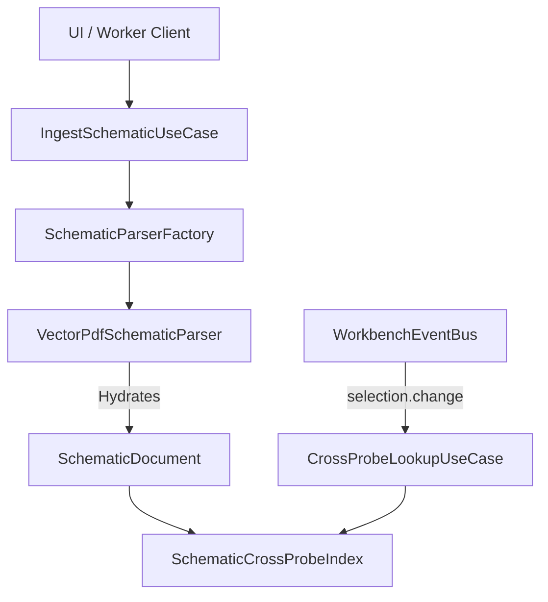
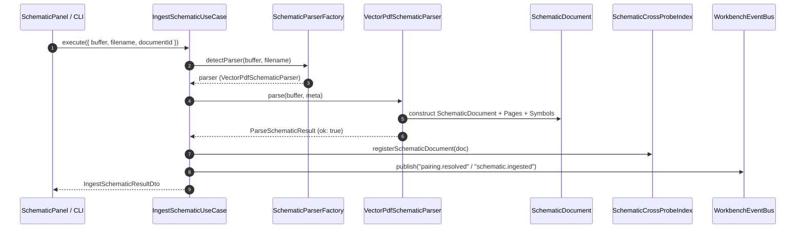

# Technical Design: Schematic Ingestion Engine

## Technical Approach & Architecture
We establish a Clean / Hexagonal architecture for vector schematic ingestion, aggregate construction, and cross-probing synchronization in BoardForge:

1. **Domain Layer**: Pure entities and aggregates (`SchematicDocument`, `SchematicSheet` / `SchematicPage`, `SchematicSymbol`, `SchematicNet`, `SchematicPinLocation`). Interfaces/ports: [`ISchematicParser`](file:///c:/Users/LAB-JOSE/Desktop/BoardForge/src/domain/schematics/ports/ISchematicParser.ts), `ISchematicCrossProbeIndex`.
2. **Infrastructure Layer**: Format sniffing and parsers (`VectorPdfSchematicParser`, `SchematicParserFactory`). Byte-sniffing for `%PDF-` vs CAD formats, extracting text tokens (`VectorToken`) and symbol geometries with bounded error recovery (`ParseError`, `ParseDiagnostic`).
3. **Application Layer**: Ingestion and cross-probing use cases ([`IngestSchematicUseCase`](file:///c:/Users/LAB-JOSE/Desktop/BoardForge/src/application/schematics/commands/IngestSchematicUseCase.ts), `CrossProbeLookupUseCase`, [`SchematicsFacade`](file:///c:/Users/LAB-JOSE/Desktop/BoardForge/src/application/schematics/SchematicsFacade.ts)).
4. **UI & Cross-Panel Sync**: Integration between [`SchematicPanel`](file:///c:/Users/LAB-JOSE/Desktop/BoardForge/src/ui/schematics/SchematicPanel.tsx) and `BoardViewPanel` via [`WorkbenchEventBus`](file:///c:/Users/LAB-JOSE/Desktop/BoardForge/src/application/workbench/WorkbenchEventBus.ts) (`selection.change`, `search.focus`, `page.navigate`).



---

## Architectural Decisions

| Decision | Choice | Alternatives | Rationale |
| :--- | :--- | :--- | :--- |
| **Worker / Stream Parsing** | Asynchronous pure parser implementing `ISchematicParser` with typed `ParseSchematicResult` | Monolithic synchronous parser on main thread | Keeps main loop responsive; supports Web Worker isolation and node execution without UI freeze. |
| **Cross-Probe Indexing** | In-memory bidirectional hash maps (`pinToSchematicMap`, `netToBoardViewPads`) | Dynamic AST traversal on click | Guarantees sub-millisecond lookup latency (< 1ms) for synchronized dual-canvas rendering. |
| **Error Recovery** | Discriminated union result (`ok: true/false`) + page-level diagnostic warnings | Throwing uncaught exceptions | Prevents corrupted PDF pages from failing ingestion of entire multi-sheet documents. |

---

## Data Flow



---

## File Changes Table

| File | Action | Purpose |
| :--- | :--- | :--- |
| [`src/domain/schematics/ports/ISchematicParser.ts`](file:///c:/Users/LAB-JOSE/Desktop/BoardForge/src/domain/schematics/ports/ISchematicParser.ts) | Modify/Verify | Define parser port, diagnostic contracts, and result types. |
| [`src/domain/schematics/ports/ISchematicCrossProbeIndex.ts`](file:///c:/Users/LAB-JOSE/Desktop/BoardForge/src/domain/schematics/ports/ISchematicCrossProbeIndex.ts) | Create | Define domain port contract for cross-probe coordinate lookup. |
| [`src/infrastructure/schematics/parsers/VectorPdfSchematicParser.ts`](file:///c:/Users/LAB-JOSE/Desktop/BoardForge/src/infrastructure/schematics/parsers/VectorPdfSchematicParser.ts) | Create | Implement `ISchematicParser` with magic header sniff and vector token extraction. |
| [`src/infrastructure/schematics/parsers/SchematicParserFactory.ts`](file:///c:/Users/LAB-JOSE/Desktop/BoardForge/src/infrastructure/schematics/parsers/SchematicParserFactory.ts) | Create | Factory for selecting and sniffing schematic parsers. |
| [`src/application/schematics/commands/IngestSchematicUseCase.ts`](file:///c:/Users/LAB-JOSE/Desktop/BoardForge/src/application/schematics/commands/IngestSchematicUseCase.ts) | Create | Application command handler orchestrating parser execution and index hydration. |
| [`src/application/schematics/queries/CrossProbeLookupUseCase.ts`](file:///c:/Users/LAB-JOSE/Desktop/BoardForge/src/application/schematics/queries/CrossProbeLookupUseCase.ts) | Create | Query service executing < 1ms coordinate and net lookup. |
| [`src/application/schematics/SchematicsFacade.ts`](file:///c:/Users/LAB-JOSE/Desktop/BoardForge/src/application/schematics/SchematicsFacade.ts) | Modify | Expose ingestion and cross-probing methods to API/UI. |
| [`src/ui/schematics/SchematicPanel.tsx`](file:///c:/Users/LAB-JOSE/Desktop/BoardForge/src/ui/schematics/SchematicPanel.tsx) | Modify | Bind to cross-probe index and event bus updates. |

---

## Interfaces / Contracts

```typescript
export interface IngestSchematicCommand {
  documentId: string;
  filename: string;
  rawBytes: Uint8Array;
  organizationId?: string;
}

export interface IngestSchematicResultDto {
  documentId: string;
  pageCount: number;
  symbolCount: number;
  netCount: number;
  diagnostics: ParseDiagnostic[];
}

export interface ISchematicCrossProbeIndex {
  registerSchematicDocument(doc: SchematicDocument): void;
  queryFromBoardViewPin(refDes: string, pinNumber: string): SchematicPinHit[];
  queryFromBoardViewNet(netName: string): NetLabelMatch[];
  queryFromSchematicCoordinate(pageNumber: number, x: number, y: number): SchematicCoordinateLookupResult;
}
```

---

## Testing Strategy
- **Unit Tests (TDD)**:
  - `VectorPdfSchematicParser.spec.ts`: Test magic MIME detection (`%PDF-`), valid vector extraction, corrupted buffer handling (`CorruptedStreamError`), and partial sheet resiliency.
  - `SchematicParserFactory.spec.ts`: Test parser registration and fallback to `UnsupportedFormatError`.
  - `SchematicCrossProbeIndex.spec.ts`: Verify multi-sheet symbol aggregation, disambiguation, and < 1ms lookup latency.
- **Integration Tests**:
  - `IngestSchematicUseCase.spec.ts`: End-to-end ingestion flow from raw bytes to aggregate hydration and cross-probe registration.
  - `SchematicSyncIntegration.spec.ts`: Cross-panel event bus synchronization between BoardView and Schematic panels.

---

## Migration, Rollout & Open Questions
- **Rollout**: Additive domain and infrastructure modules. Existing mock loaders can be swapped with `VectorPdfSchematicParser` without breaking schema contracts.
- **Open Questions**: None blocking. Default fallback parsing handles single-page and multi-page schematics uniformly.
